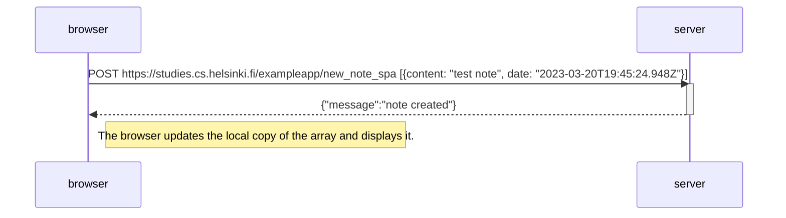

```mermaid
sequenceDiagram
    participant browser
    participant server

    browser->>server: POST https://studies.cs.helsinki.fi/exampleapp/new_note_spa [{content: "test note", date: "2023-03-20T19:45:24.948Z"}]
    activate server
    server-->>browser: {"message":"note created"}
    deactivate server

    Note right of browser: The browser updates the local copy of the array and displays it.
```